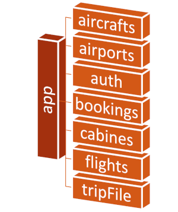

# Base de données
Cette section aborde les informations relatives à la modélisation de la base de données.

## MongoDB
MongoDB est une base de données NoSQL orientée documents. Cela signifie qu'elle stock les données sous forme de documents JSON (JavaScript Object Notation), plutôt que sous forme de tables comme dans les bases de données relationnelles classiques.

## Architecture



Les documents sont donc sauvegardés dans différentes collections de la base de données 'app'. Nous allons ici faire une description de l'utilité de chaque collection, et de la structure de données interne.

## aircrafts
Cette collection dispose d'une liste représentant les avions exploités par la compagnie. Voici un exemple d'objet JSON :

```json
{
  "_id": "9586237",
  "aircraft_type": "AIRBUS A380",
  "seats_config_economy": "343",
  "seats_config_premium": "232",
  "seats_config_business": "222",
  "seats_config_first": "121",
  "seats_economy": "500",
  "seats_premium": "120",
  "seats_business": "60",
  "seats_first": "4"
}
```

Un avion est donc représenté de la manière suivante :

- ***'_id'***, un identifiant arbitraire permettant d'identifier l'appareil
- ***'aircraft_type'***, indiquant le modèle de l'appareil
- les champs ***'seats_config_'*** indique l'agencement des sièges de l'appareil, pour une classe donnée (cela étant utile pour le front afin d'afficher la disposition des sièges)
- les champs ***'seats_'*** indique le nombre de sièges disponibles, pour une classe donnée

## airports

Cette collection dispose d'une liste représentant une liste assez complète d'aéroport. Voici un exemple d'objet JSON :

```json
{
  "_id": {
    "$oid": "63516488713d1eeeaa010f90"
  },
  "name": "Charles De Gaulle",
  "city": "Paris",
  "country": "France",
  "iata_code": "CDG",
  "_geoloc": {
    "lat": 49.012779,
    "lng": 2.55
  },
  "links_count": 1041,
  "objectID": "1382"
}
```

Voici une description des données potentiellement exploitable:

- ***'_id'***, un identifiant géré par MongoDB permettant d'identifier l'aéroport
- ***'name'***, le nom de l'aéroport
- ***'city'***, la ville que déssert l'aéroport
- ***'country'***, le pays où se situe l'aéroport
- ***'iata_code'***, le code IATA qui lui est associé
- ***'_geoloc'***, les coordonnées géographiques de l'aéroport
- ***'objectID'***, la référence interne

!!! warning

    Exceptionnellement, l'application n'utilise pas l'ObjectID MongoDB ('_id') pour les références de clefs, mais bien 'objectID'.


## auth

Cette collection permet la gestion de l'authentification sur cette plateforme de réservation. Voici un exemple de représentation JSON dans la base :

```json
{
  "_id": {
    "$oid": "63556e95ee853ccb0be3f7c5"
  },
  "lName": "DUPONT",
  "fName": "Marie",
  "email": "marie.dupont@exemple.fr",
  "password": "",
  "birtDate": "01/09/1999",
  "status": "OK"
}
```

Un utilisateur est donc représenté de la manière suivante :

- ***'_id'***, un identifiant géré par MongoDB permettant d'identifier l'utilisateur
- ***'lName'***, le nom de famille de l'utilisateur
- ***'fName'***, la prénom de l'utilisateur
- ***'email'***, l'adresse email de l'utilisateur'
- ***'password'***, le mot de passe chiffré en base de l'utilisateur
- ***'birtDate'***, la date de naissance de l'utilisateur (format norme JSON yyyy-MM-dd)
- ***'status'***, flag indiquant si l'utilisateur créé est exploitable si la valeur est à 'OK'

## bookings

Cette collection permet de stocker toutes les réservations (ou préreservations) de billets d'avion sur la plateforme. Voici un exemple de représentation JSON dans la base :

```json
{
  "_id": {
    "$oid": "63b97bb791f66500671d6186"
  },
  "flight": "63989842f0298246cc397fed",
  "class": "f",
  "passenger": null
}
```

Une réservation est donc représentée de la manière suivante :

- ***'_id'***, un identifiant géré par MongoDB permettant d'identifier la réservation
- ***'flight'***, une clef étrangère référençant un objet de la collection 'flight' (son ObjectID MongoDB)
- ***'class'***, la classe de réservation
- ***'passenger'***, une clef étrangère référençant un objet de la collection 'passengers' (son ObjectID MongoDB)

!!! note

    Une Réservation = un vol = un passager. Ces réservations vont être stockés dans 'tripFile' pour être composés dans des dossiers de réservation.

## cabines

Cette collection permet de stocker toutes les cabines. Voici un exemple de représentation JSON dans la base :

```json
{
  "_id": {
    "$oid": "635160f8713d1eeeaa00b5ad"
  },
  "cabine": "Economy"
}
```

Une cabine est donc représentée de la manière suivante :

- ***'_id'***, un identifiant géré par MongoDB permettant d'identifier la réservation
- ***'cabine'***, le nom de la classe

## flights

Cette collection permet de stocker tous les vols prévus par la compagnie. Voici un exemple de représentation JSON dans la base :

```json
{
  "_id": {
    "$oid": "63989842f0298246cc397fed"
  },
  "airport_departure": 3682,
  "airport_arrival": 3830,
  "date_departure": {
    "$date": {
      "$numberLong": "1690761600000"
    }
  },
  "date_arrival": {
    "$date": {
      "$numberLong": "1690848000000"
    }
  },
  "time_departure": 480,
  "time_arrival": 670,
  "duration": 190,
  "aircraft": 9586237,
  "price_economy": 400,
  "price_premium": 800,
  "price_business": 1200,
  "price_first": 1500
}
```

Un vol est donc représenté de la manière suivante :

- ***'_id'***, un identifiant géré par MongoDB permettant d'identifier le vol
- ***'airport_departure'***, une clef étrangère référençant un objet de la collection 'airport'(le champ 'objectID'), représentant l'aéroport de départ
- ***'airport_arrival'***, une clef étrangère référençant un objet de la collection 'airport'(le champ 'objectID'), représentant l'aéroport d'arrivée
- ***'date_departure'***, date de départ du vol (géré par MongoDB), ne pas éditer directement le long
- ***'date_departure'***, date de départ du vol (géré par MongoDB), ne pas éditer directement le long
- ***'time_departure'***, représentation en minutes de l'heure de départ.
- ***'time_arrival'***, représentation en minutes de l'heure d'arrivée.

!!! example

    Un vol avec un départ à 18h30 sera réprésenté par '1140', puisqu'il faut 1140 minutes depuis minuit pour arriver à 18h30

- ***'duration'***, durée théorique du vol
- ***'aircraft'***, une clef étrangère référençant un objet de la collection 'aircrafr'(son ObjectID MongoDB), représentant l'appareil utilisé pour ce vol
- ***'price_\*'***, prix du vol pour une classe donnée

## tripFile

Cette collection permet de stocker tout les dossiers de réservation. Voici un exemple de représentation JSON dans la base :

```json
{
  "_id": {
    "$oid": "63ab0bc23af4b28c3ec38e5c"
  },
  "status": "validated",
  "bookings": [
    [
      "63b97d04dab62593e2fc6459",
      null
    ],
    [
      "63b97d04dab62593e2fc6459",
      null
    ],
  ]
}
```

Un dossier est donc représentée de la manière suivante :

- ***'_id'***, un identifiant géré par MongoDB permettant d'identifier le dossier
- ***'status'***, statut de la réservation. Celle ci peut avoir différents statuts tel que :
    - *'search'* : le dossier est juste créé en cache lors d'une recherche
    - *'partial'* : le dossier contiens des vols, mais n'a pas été finalisé
    - *'validated'* : le dossier est validé. Le client peut alors régler le montant de la réservation, et renseigner les informations passagers.
    - *'paid'* : le dossier est payé, prêt à décoller !
- ***'bookings'***, tableau de réservations.

!!! note

    Un élément du tableau 'booking' contiens une paire de valeur contenant la référence à un objet 'flight' (à l'index 0) et à un objet 'passengers' (à l'index 1).